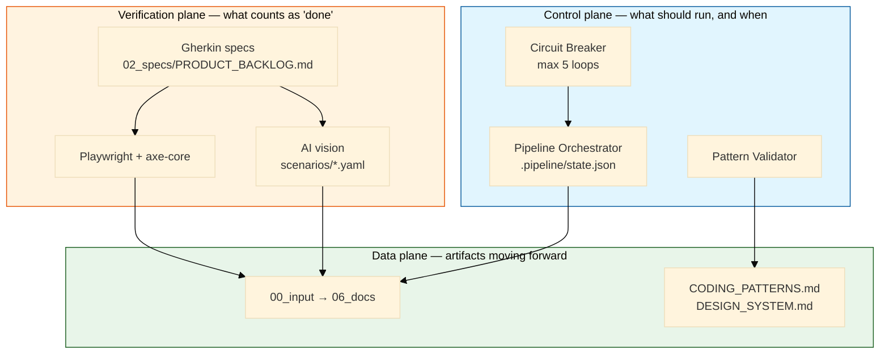
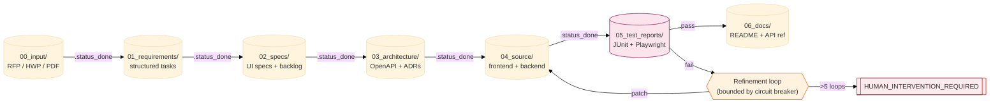
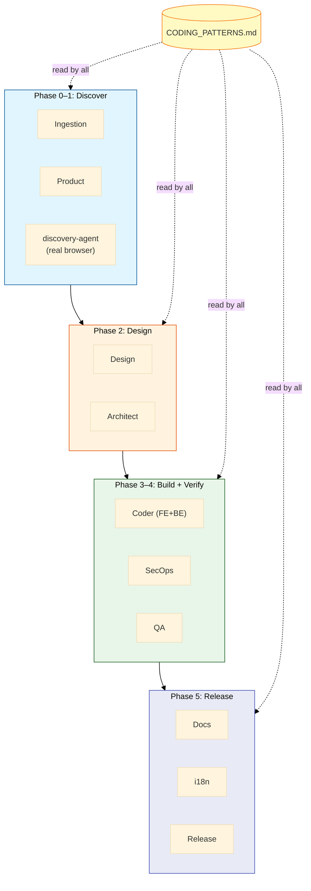
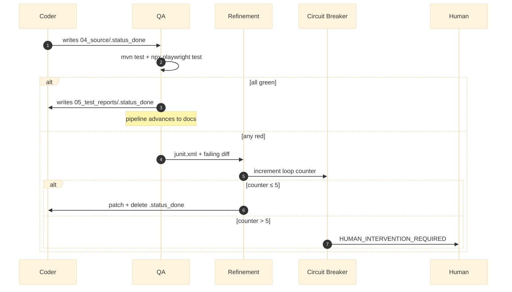
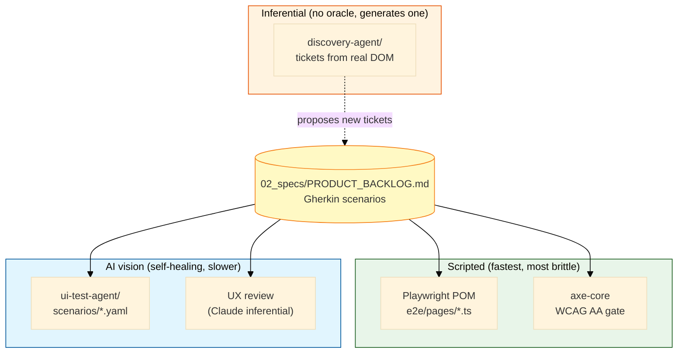
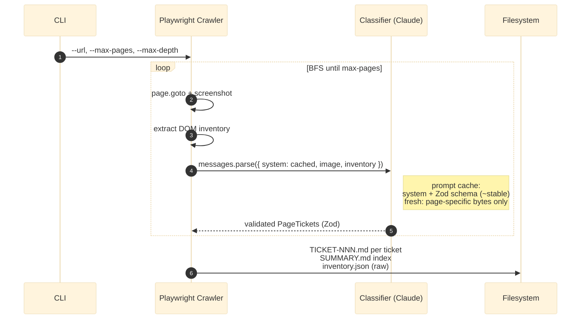

# ASDLC Workspace — Full Architecture

How everything in `asdlc-workspace/` fits together. This is the runtime view of the seven definitions in `README.md`, with the discovery agent and test oracle wired in.

Source-of-truth specs live in the parent directory (`../01-PIPELINE_ARCHITECTURE.md`, `../02-CODING_PATTERNS.md`, `../07-UI_TESTING_GUIDE.md`). This doc is the deployed instantiation.

---

## 1. Three planes

Every component sits in one of three planes. Keeping them separate is what makes the loop debuggable.



| Plane | Owns | Failure means |
|---|---|---|
| Control | When agents run, when to stop | Pipeline halts; no work lost |
| Data | Generated artifacts (specs, code, docs) | Bad code in `04_source/` |
| Verify | The pass/fail signal | Agents loop without ground truth |

---

## 2. Phase state machine

Phase transitions are gated by `.status_done` markers in each directory. The orchestrator never advances without them; the QA agent never writes one if tests fail.



The 7-step pipeline is not theoretical — `.pipeline/state.json` literally tracks `current_phase` and the orchestrator polls for `<phase>/.status_done` before advancing.

---

## 3. Agent topology

Eleven agents, each with a single artifact-shaped responsibility. **All read `CODING_PATTERNS.md` first** — that's the constraint that keeps NEW-project mode from drifting.



| Agent | Reads | Writes |
|---|---|---|
| Ingestion | `00_input/*` | `01_requirements/REQ_DATA.json` |
| Product | requirements | `02_specs/PRODUCT_BACKLOG.md` (Gherkin) |
| **discovery-agent** | live URL | `01_requirements/discovered/tickets/*.md` |
| Design | backlog + project type | `02_specs/UI_SPECS.json` |
| Architect | UI specs | `03_architecture/openapi.yaml` + ADRs |
| Coder | architecture + patterns | `04_source/frontend` + `backend` |
| SecOps | source | `04_source/security-audit.json` |
| QA | source + Gherkin | `05_test_reports/results.json` |
| Refinement | failed reports | patches to `04_source/` |
| Docs | passing source + OpenAPI | `06_docs/README.md`, `API_REFERENCE.md` |

`discovery-agent` is the only agent that reads from a *running* system — everything else reads files. It's how you bootstrap a backlog from an existing app instead of from a doc.

---

## 4. The constraint: `CODING_PATTERNS.md`

Every agent loads this file before generating anything. It's a single document with nine sections (project type, stack, colors, typography, spacing, components, error handling, writing standards, anti-patterns). The Validator agent re-reads it on every run and rejects code that violates it.

| Mode | Constraint |
|---|---|
| `mode: new` | Sections 5–6 start empty; agents fill them as they establish patterns; subsequent agents must reuse what's there. |
| `mode: maintenance` | All sections frozen; deviations require an ADR. |

If `CODING_PATTERNS.md` is empty *and* `mode: maintenance`, the pipeline refuses to start. That's the Definition-of-Ready gate.

---

## 5. Feedback loop & circuit breaker

The whole pipeline is one big read-eval-print loop. The QA agent is the discriminator; the Refinement agent is the patcher.



**Why bounded:** without the circuit breaker, an agent in a fix-fail-fix loop can burn through API credit overnight. The 5-loop ceiling is a reasoned guess at "we'd want eyes on this anyway" — tunable in `.pipeline/config.yaml:refinement.max_loops`.

---

## 6. Test oracle stack

Three layers, all bound to the same Gherkin contract.



| Layer | Brittleness | Cost | Use for |
|---|---|---|---|
| Playwright POM + axe | High (selectors break) | ~free | Golden-path regression on stable flows |
| ui-test-agent | Self-healing on copy/layout drift | ~$0.01–0.05 per scenario run | UX review, exploratory flows |
| discovery-agent | N/A — generates the spec | ~$0.03–0.10 per page (Opus 4.7) | Bootstrapping a backlog from an existing app |

Layer 3 isn't really an oracle — it produces *new* tickets that then become layer-1/2 oracles. That's why the arrow goes back to `02_specs/`.

---

## 7. Discovery agent internals

The only agent that crosses the public-internet boundary. Worth a closer look because the cost model depends on prompt caching being right.



Cost discipline:
- **Cache breakpoint** on the system prompt → page 2..N read most input from cache (~0.1× cost).
- **Zod schema** validates the structured output — no hand-parsing, no JSON-in-string fragility.
- **Adaptive thinking** + `effort: "high"` — the model decides when to think hard about ambiguous components.
- **One round-trip per page** — no chained tool calls, so the cost is predictable and bounded.

If you point it at a 50-page app with caching working, expect ~$2–5 total on Opus 4.7. Without caching, expect 5–10× that.

---

## 8. File layout (rendered)

```
asdlc-workspace/
├── README.md                          ← bootstrap + audit checklist
├── ARCHITECTURE.md                    ← this file
├── CODING_PATTERNS.md                 ← the constraint, all agents read it
├── .env.example                       ← LLM provider, refinement loops
├── .gitignore
├── .githooks/pre-commit               ← branch + secret + .env gates
├── .pipeline/
│   ├── config.yaml                    ← project type, agents enabled
│   └── state.json                     ← current phase, refinement counter
│
├── 00_input/                          ← raw RFP / HWP / PDF
├── 01_requirements/                   ← structured tasks (JSON)
│   └── discovered/                    ← discovery-agent output
│       ├── tickets/TICKET-NNN.md
│       ├── screenshots/*.png
│       ├── inventory.json
│       └── SUMMARY.md
├── 02_specs/
│   └── PRODUCT_BACKLOG.md             ← Gherkin, the test oracle
├── 03_architecture/                   ← OpenAPI + ADRs
├── 04_source/
│   └── frontend/
│       ├── playwright.config.ts       ← reports → 05_test_reports/
│       ├── package.json
│       └── e2e/
│           ├── home.spec.ts           ← bound to STORY-001
│           └── pages/HomePage.ts      ← Page Object Model
├── 05_test_reports/                   ← JUnit + Playwright HTML + JSON
├── 06_docs/                           ← README, API_REFERENCE.md
│
└── scenarios/
    └── home.yaml                      ← AI vision scenario for ui-test-agent
```

`discovery-agent/` is a sibling repo: <https://github.com/fankh/discovery-agent>. Clone it next to this workspace if you want to run discovery against a real target.

---

## 9. Failure modes

The asymmetry to keep in mind: cheap mistakes (one ticket missed) vs. expensive ones (overnight credit burn).

| Failure | Detection | Recovery |
|---|---|---|
| Coder produces invalid HTML | QA agent fails E2E test | Refinement loop patches; bounded by circuit breaker |
| Selector drift breaks Playwright | Playwright test fails | Either fix selector OR pivot to AI vision scenario |
| AI vision misclassifies a button | UX review flags inconsistency | Add explicit selector to ui-test-agent YAML |
| Discovery-agent over-generates tickets | Manual review of `SUMMARY.md` | Reject low-priority tickets before they hit the backlog |
| Pipeline stuck in refinement loop | Counter exceeds 5 | `HUMAN_INTERVENTION_REQUIRED` flag halts orchestrator |
| Pre-commit hook bypassed | `git log` shows commit on `main` | Per `feedback_git_workflow`, blocked by hook — but verify via `git config core.hooksPath .githooks` |
| Secrets committed | `git secrets --pre_commit_hook` or grep heuristic | Hook aborts; rewrite history if it slipped |
| LLM credit exhaustion | Anthropic 429s | Circuit breaker stops; switch to `LLM_PROVIDER=ollama` to keep working |

---

## 10. What's NOT here yet

Honest accounting of stubs. The roadmap to close each gap lives in [`PLAN.md`](PLAN.md) — phase number in parentheses below.

- **No actual orchestrator script** (Phase 1). `.pipeline/config.yaml` is the *contract* the orchestrator would read; `run-pipeline.py` is referenced in `../01-PIPELINE_ARCHITECTURE.md` but not implemented in this workspace. You drive the loop manually for now (run discovery → review tickets → run coder agent → run QA).
- **No backend yet** (Phase 2). `04_source/backend/` doesn't exist — only the frontend test scaffolding is wired. Add when the Architect agent generates `openapi.yaml`.
- **No deployment** (Phase 4). Phase 5 (Release) is intentionally disabled in `.pipeline/config.yaml`. Local dev only until you decide to ship.
- **No memory store.** The agents don't remember prior runs. If you want long-running agentic workflows, see `../ai-sdlc-research/` and the Managed Agents path.

For the full sequencing (which gap to close first, what proves it's done), open [`PLAN.md`](PLAN.md).
